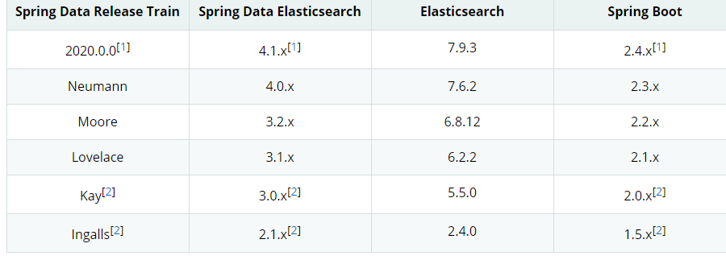

## 上一次学到了安装ElasticSearch,由于版本兼容问题，最后选择了6.8.12
## 这次将学习搭建一个java后台，使用java api的方法来新建索引
### 一、环境及相关文档
#### 1、相关文档 
- [springboot2.2整合spring-data-elasticsearch3.2](https://blog.csdn.net/haohaifeng002/article/details/102887921)
- [Spring Data Elasticsearch](https://docs.spring.io/spring-data/elasticsearch/docs/current/reference/html/#preface.versions)
- [IK分词器](https://github.com/medcl/elasticsearch-analysis-ik)
#### 2、环境
本次环境使用 `spring boot`快速搭建，使用`sping-data-elasticsearch` 作为client进行与es服务端交互。
由于`elasticsearch`版本迭代很快，所以需要进行文档的查询
相关版本对应关系  
  
**由于版本原因，采用了`Moore`版本-------->对应版本为 Spring Data Elasticsearch 3.2.x + Elasticsearch 6.8.12 + Spring Boot 2.2.x**
#### 3、安装IK中文分词插件
**确保安装的分词插件与Elasticsearch版本一致**
这里选择的是推荐方式一安装的，方式二可能会有问题
1、下载对应release版本的插件 [6.8.12 plugin下载](https://github.com/medcl/elasticsearch-analysis-ik/releases/download/v6.8.12/elasticsearch-analysis-ik-6.8.12.zip)
2、`cd /opt/elasticsearch-6.8.12/plugins/ && mkdir ik`
3、解压 ` unzip /opt/elasticsearch-analysis-ik-6.8.12.zip -d . `
4、重启Elasticsearch
### **二、项目配置**
#### 1、pom文件
```xml
<?xml version="1.0" encoding="UTF-8"?>
<project xmlns="http://maven.apache.org/POM/4.0.0" xmlns:xsi="http://www.w3.org/2001/XMLSchema-instance"
         xsi:schemaLocation="http://maven.apache.org/POM/4.0.0 https://maven.apache.org/xsd/maven-4.0.0.xsd">
    <modelVersion>4.0.0</modelVersion>
    <parent>
        <groupId>org.springframework.boot</groupId>
        <artifactId>spring-boot-starter-parent</artifactId>
        <version>2.2.7.RELEASE</version>
        <relativePath/> <!-- lookup parent from repository -->
    </parent>
    <groupId>cn.beichenhpy</groupId>
    <artifactId>es</artifactId>
    <version>0.0.1-SNAPSHOT</version>
    <name>es</name>
    <description>es for beichenhpy</description>

    <properties>
        <java.version>1.8</java.version>
    </properties>

    <dependencies>
        <!-- https://mvnrepository.com/artifact/org.springframework.data/spring-data-elasticsearch -->
        <dependency>
            <groupId>org.springframework.data</groupId>
            <artifactId>spring-data-elasticsearch</artifactId>
            <version>3.2.7.RELEASE</version>
        </dependency>

        <dependency>
            <groupId>org.springframework.boot</groupId>
            <artifactId>spring-boot-starter-web</artifactId>
        </dependency>

        <dependency>
            <groupId>mysql</groupId>
            <artifactId>mysql-connector-java</artifactId>
            <scope>runtime</scope>
        </dependency>
        <dependency>
            <groupId>org.projectlombok</groupId>
            <artifactId>lombok</artifactId>
            <optional>true</optional>
        </dependency>
        <dependency>
            <groupId>org.springframework.boot</groupId>
            <artifactId>spring-boot-starter-test</artifactId>
            <scope>test</scope>
        </dependency>
    </dependencies>

    <build>
        <plugins>
            <plugin>
                <groupId>org.springframework.boot</groupId>
                <artifactId>spring-boot-maven-plugin</artifactId>
                <configuration>
                    <excludes>
                        <exclude>
                            <groupId>org.projectlombok</groupId>
                            <artifactId>lombok</artifactId>
                        </exclude>
                    </excludes>
                </configuration>
            </plugin>
        </plugins>
    </build>

</project>

```
#### 2、配置文件
```yaml
server:
  port: 8888
spring:
  elasticsearch:
    rest:
      uris: http://es.beichenhpy.cn
```
#### 3、实体类设置（对应索引）
```java
package cn.beichenhpy.es.entity;

import lombok.AllArgsConstructor;
import lombok.Builder;
import lombok.Data;
import lombok.NoArgsConstructor;
import org.springframework.data.annotation.Id;
import org.springframework.data.elasticsearch.annotations.Document;
import org.springframework.data.elasticsearch.annotations.Field;
import org.springframework.data.elasticsearch.annotations.FieldType;
import org.springframework.data.elasticsearch.core.geo.GeoPoint;

import java.util.List;

/**
 * @author A51398
 * @version 1.0
 * @description TODO student实体类
 * @since 2021/1/6 10:20
 */
@Data
@Builder
/*
这里要有无参构造函数，不然无法反序列化
*/
@NoArgsConstructor
@AllArgsConstructor
/*
indexName:索引名
type:类型
shards:分片(默认为5)
replicas:备份(默认1，单节点要设置为0)
*/
@Document(indexName = "student",type = "docs",shards = 5,replicas = 0)
public class Student {
    @Id
    private Integer id;
    //anlyzer 分词设置为 ik_max_word
    @Field(type = FieldType.Text,analyzer = "ik_max_word")
    private String name;
    @Field(type = FieldType.Date)
    private String birthday;
    //经纬度
    private GeoPoint point;
    private List<Book> books;
}

```
```java
package cn.beichenhpy.es.entity;

import lombok.AllArgsConstructor;
import lombok.Builder;
import lombok.Data;
import lombok.NoArgsConstructor;
import org.springframework.data.annotation.Id;
import org.springframework.data.elasticsearch.annotations.Document;
import org.springframework.data.elasticsearch.annotations.Field;
import org.springframework.data.elasticsearch.annotations.FieldType;

/**
 * @author A51398
 * @version 1.0
 * @description TODO book实体类
 * @since 2021/1/6 10:23
 */
@Data
@Builder
@NoArgsConstructor
@AllArgsConstructor
@Document(indexName = "books",type = "docs",shards = 5,replicas = 0)
public class Book {
    @Id
    private Integer id;
    @Field(type = FieldType.Text,analyzer = "ik_max_word")
    private String name;
}

```
4、建立Repo接口（等同于Spring Boot Data Jpa）
```java
package cn.beichenhpy.es.repo;

import cn.beichenhpy.es.entity.Student;
import org.springframework.data.elasticsearch.repository.ElasticsearchRepository;

/**
 * @author beichenhpy
 * @version 1.0
 * @description TODO repo层 <entity,type(id)>
 * @since 2021/1/6 10:27
 */
public interface ESSaveRepo extends ElasticsearchRepository<Student,Integer> {

}

```
5、建立控制层(方便测试，先写在控制层，以后会分层)
```java
package cn.beichenhpy.es.controller;

import cn.beichenhpy.es.entity.Book;
import cn.beichenhpy.es.entity.Result;
import cn.beichenhpy.es.entity.Student;
import cn.beichenhpy.es.repo.ESSaveRepo;
import org.springframework.beans.factory.annotation.Autowired;
import org.springframework.data.elasticsearch.core.ElasticsearchRestTemplate;
import org.springframework.data.elasticsearch.core.geo.GeoPoint;
import org.springframework.web.bind.annotation.GetMapping;
import org.springframework.web.bind.annotation.PostMapping;
import org.springframework.web.bind.annotation.RestController;

import java.util.ArrayList;
import java.util.List;

/**
 * @author beichenhpy
 * @version 1.0
 * @description TODO 测试控制层
 * @since 2021/1/6 10:29
 */
@RestController
public class StudentController {
    @Autowired
    private ESSaveRepo esSaveRepo;
    @Autowired
    private ElasticsearchRestTemplate elasticsearchRestTemplate;
    @GetMapping("/getAllIndex")
    public Result<?> getAllIndex(){
        return Result.ok(esSaveRepo.findAll());
    }
    @PostMapping("/addIndex")
    public Result<?> addIndex(){
        Book book1 = Book.builder().id(1).name("小明历险记1").build();
        Book book2 = Book.builder().id(2).name("小明历险记2").build();
        Book book3 = Book.builder().id(3).name("小明历险记3").build();
        List<Book> list = new ArrayList<>();
        list.add(book1);
        list.add(book2);
        list.add(book3);
        Student student = Student.builder().id(1).birthday("2020-10-01").books(list).name("小明").point(new GeoPoint(51.500152D, -0.126236D)).build();
        esSaveRepo.save(student);
        return Result.ok(student);
    }
}

```
### 
