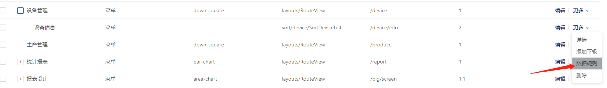
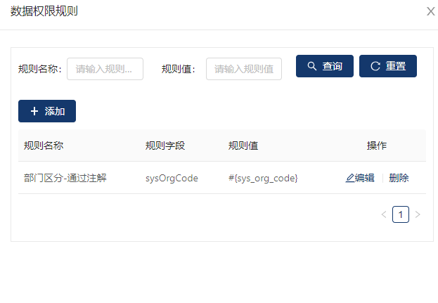
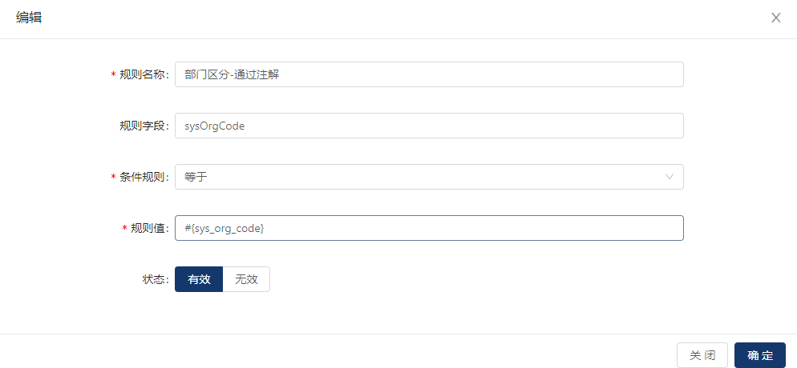
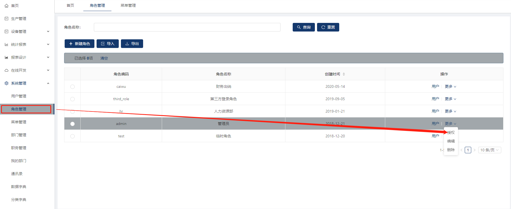
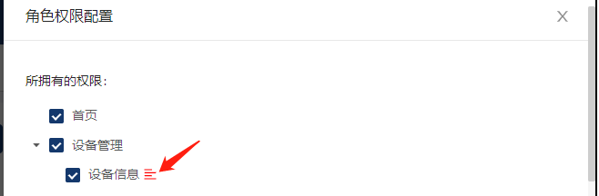
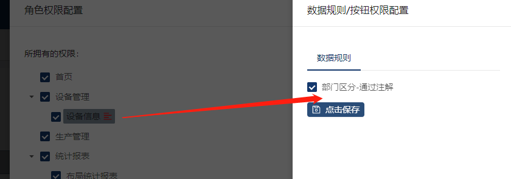

参考 [jeecg-boot 数据权限](https://blog.csdn.net/gwcgwcjava/article/details/104162346)


1. 在菜单管理中 选择要设置权限的子菜单  
  
2. 点击数据规则  
  
3. 新建一个如图所示的规则（以部门分离为例）
sysOrgCode 右模糊 #{sys_org_code} 这样就可以上级查询下级的信息 
  
4. 在角色管理中，在你想要的设置部门分离的角色，配置对应的数据权限规则  
  
5. 点击授权，右侧弹出页面，注意：有红色的代表设置了数据权限规则  
  
6. 点击红色的部分，弹出右侧框，选择你要启用的数据规则，保存生效  
  
7. 在后台需要进行数据权限规则生效的方法上，添加注解
```java
// pageComponent为菜单配置的组件位置
@PermissionData(pageComponent = "smt/device/SmtDeviceList")
```


