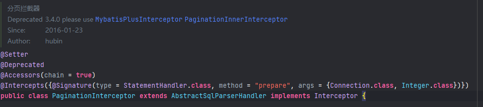
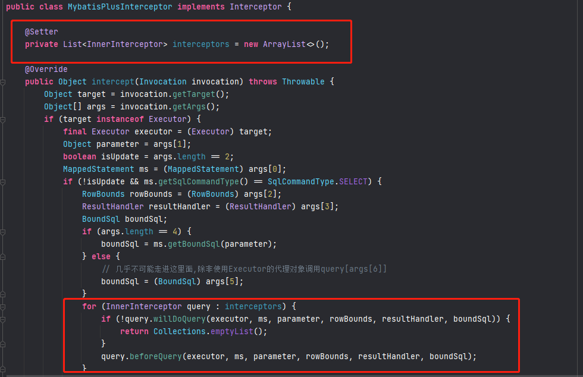
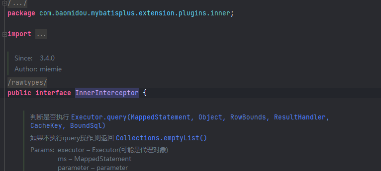
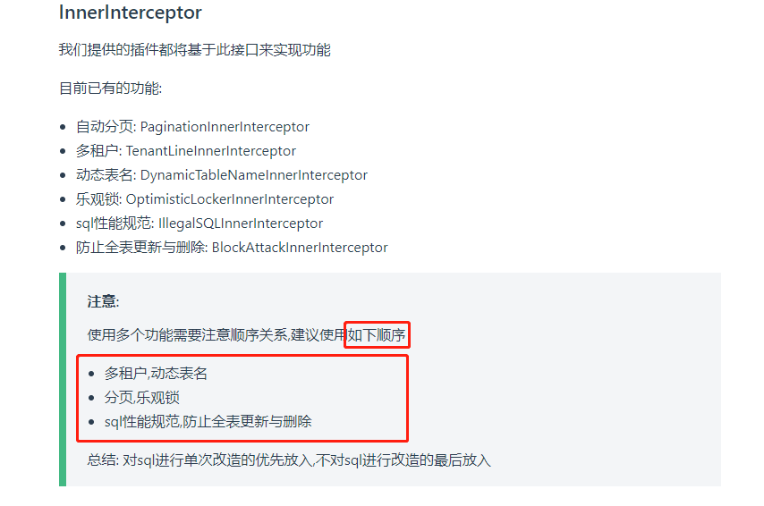

# 版本对比
在3.4.0版本之前，Mybatis-Plus的插件是通过实现MyBatis的接口 `Interceptor`实现的，因此，在使用时，需要手动注册每个插件的bean。

在3.4.0版本后，Mybatis-Plus可能出于拓展性以及插件执行顺序的考虑，自己实现了一套拦截器，原理是在
Mybatis的拦截器链中，又套了一层拦截器链
Mybatis-Plus 实现了Mybatis的拦截器---->`MybatisPlusInterceptor`

在此拦截器中内部又实现了拦截器链，用于用户自己拓展插件，也更容易控制顺序。
内部拦截器 `InnerInterceptor`

实现了很多拦截器
官网上很详细。注意顺序

# 使用方法
```java
@Configuration
@MapperScan("scan.your.mapper.package")
public class MybatisPlusConfig {

    /**
     * 新的分页插件,一缓和二缓遵循mybatis的规则,需要设置 MybatisConfiguration#useDeprecatedExecutor = false 避免缓存出现问题(该属性会在旧插件移除后一同移除)
     */
    @Bean
    public MybatisPlusInterceptor mybatisPlusInterceptor() {
        MybatisPlusInterceptor interceptor = new MybatisPlusInterceptor();
        interceptor.addInnerInterceptor(new PaginationInnerInterceptor(DbType.H2));
        return interceptor;
    }

    @Bean
    public ConfigurationCustomizer configurationCustomizer() {
        return configuration -> configuration.setUseDeprecatedExecutor(false);
    }
}
```
# 推荐使用
1、如果你需要进行后置操作，那不推荐实现`InnerInterceptor`的方式，因为这个拦截器只有前置操作
2、如果涉及到后置操作，推荐自己实现Mybatis的`Interceptor`
# 代码附录
## MybatisPlusInterceptor
```java
/*
 * Copyright (c) 2011-2021, baomidou (jobob@qq.com).
 *
 * Licensed under the Apache License, Version 2.0 (the "License");
 * you may not use this file except in compliance with the License.
 * You may obtain a copy of the License at
 *
 *     http://www.apache.org/licenses/LICENSE-2.0
 *
 * Unless required by applicable law or agreed to in writing, software
 * distributed under the License is distributed on an "AS IS" BASIS,
 * WITHOUT WARRANTIES OR CONDITIONS OF ANY KIND, either express or implied.
 * See the License for the specific language governing permissions and
 * limitations under the License.
 */
package com.baomidou.mybatisplus.extension.plugins;

import com.baomidou.mybatisplus.core.toolkit.ClassUtils;
import com.baomidou.mybatisplus.core.toolkit.StringPool;
import com.baomidou.mybatisplus.extension.plugins.inner.InnerInterceptor;
import com.baomidou.mybatisplus.extension.toolkit.PropertyMapper;
import lombok.Setter;
import org.apache.ibatis.cache.CacheKey;
import org.apache.ibatis.executor.Executor;
import org.apache.ibatis.executor.statement.StatementHandler;
import org.apache.ibatis.mapping.BoundSql;
import org.apache.ibatis.mapping.MappedStatement;
import org.apache.ibatis.mapping.SqlCommandType;
import org.apache.ibatis.plugin.*;
import org.apache.ibatis.session.ResultHandler;
import org.apache.ibatis.session.RowBounds;

import java.sql.Connection;
import java.util.*;

/**
 * @author miemie
 * @since 3.4.0
 */
@SuppressWarnings({"rawtypes"})
@Intercepts(
    {
        @Signature(type = StatementHandler.class, method = "prepare", args = {Connection.class, Integer.class}),
        @Signature(type = StatementHandler.class, method = "getBoundSql", args = {}),
        @Signature(type = Executor.class, method = "update", args = {MappedStatement.class, Object.class}),
        @Signature(type = Executor.class, method = "query", args = {MappedStatement.class, Object.class, RowBounds.class, ResultHandler.class}),
        @Signature(type = Executor.class, method = "query", args = {MappedStatement.class, Object.class, RowBounds.class, ResultHandler.class, CacheKey.class, BoundSql.class}),
    }
)
public class MybatisPlusInterceptor implements Interceptor {

    @Setter
    private List<InnerInterceptor> interceptors = new ArrayList<>();

    @Override
    public Object intercept(Invocation invocation) throws Throwable {
        Object target = invocation.getTarget();
        Object[] args = invocation.getArgs();
        if (target instanceof Executor) {
            final Executor executor = (Executor) target;
            Object parameter = args[1];
            boolean isUpdate = args.length == 2;
            MappedStatement ms = (MappedStatement) args[0];
            if (!isUpdate && ms.getSqlCommandType() == SqlCommandType.SELECT) {
                RowBounds rowBounds = (RowBounds) args[2];
                ResultHandler resultHandler = (ResultHandler) args[3];
                BoundSql boundSql;
                if (args.length == 4) {
                    boundSql = ms.getBoundSql(parameter);
                } else {
                    // 几乎不可能走进这里面,除非使用Executor的代理对象调用query[args[6]]
                    boundSql = (BoundSql) args[5];
                }
                for (InnerInterceptor query : interceptors) {
                    if (!query.willDoQuery(executor, ms, parameter, rowBounds, resultHandler, boundSql)) {
                        return Collections.emptyList();
                    }
                    query.beforeQuery(executor, ms, parameter, rowBounds, resultHandler, boundSql);
                }
                CacheKey cacheKey = executor.createCacheKey(ms, parameter, rowBounds, boundSql);
                return executor.query(ms, parameter, rowBounds, resultHandler, cacheKey, boundSql);
            } else if (isUpdate) {
                for (InnerInterceptor update : interceptors) {
                    if (!update.willDoUpdate(executor, ms, parameter)) {
                        return -1;
                    }
                    update.beforeUpdate(executor, ms, parameter);
                }
            }
        } else {
            // StatementHandler
            final StatementHandler sh = (StatementHandler) target;
            // 目前只有StatementHandler.getBoundSql方法args才为null
            if (null == args) {
                for (InnerInterceptor innerInterceptor : interceptors) {
                    innerInterceptor.beforeGetBoundSql(sh);
                }
            } else {
                Connection connections = (Connection) args[0];
                Integer transactionTimeout = (Integer) args[1];
                for (InnerInterceptor innerInterceptor : interceptors) {
                    innerInterceptor.beforePrepare(sh, connections, transactionTimeout);
                }
            }
        }
        return invocation.proceed();
    }

    @Override
    public Object plugin(Object target) {
        if (target instanceof Executor || target instanceof StatementHandler) {
            return Plugin.wrap(target, this);
        }
        return target;
    }

    public void addInnerInterceptor(InnerInterceptor innerInterceptor) {
        this.interceptors.add(innerInterceptor);
    }

    public List<InnerInterceptor> getInterceptors() {
        return Collections.unmodifiableList(interceptors);
    }

    /**
     * 使用内部规则,拿分页插件举个栗子:
     * <p>
     * - key: "@page" ,value: "com.baomidou.mybatisplus.extension.plugins.inner.PaginationInnerInterceptor"
     * - key: "page:limit" ,value: "100"
     * <p>
     * 解读1: key 以 "@" 开头定义了这是一个需要组装的 `InnerInterceptor`, 以 "page" 结尾表示别名
     * value 是 `InnerInterceptor` 的具体的 class 全名
     * 解读2: key 以上面定义的 "别名 + ':'" 开头指这个 `value` 是定义的该 `InnerInterceptor` 属性需要设置的值
     * <p>
     * 如果这个 `InnerInterceptor` 不需要配置属性也要加别名
     */
    @Override
    public void setProperties(Properties properties) {
        PropertyMapper pm = PropertyMapper.newInstance(properties);
        Map<String, Properties> group = pm.group(StringPool.AT);
        group.forEach((k, v) -> {
            InnerInterceptor innerInterceptor = ClassUtils.newInstance(k);
            innerInterceptor.setProperties(v);
            addInnerInterceptor(innerInterceptor);
        });
    }
}
```
## InnerInterceptor
```java
/*
 * Copyright (c) 2011-2021, baomidou (jobob@qq.com).
 *
 * Licensed under the Apache License, Version 2.0 (the "License");
 * you may not use this file except in compliance with the License.
 * You may obtain a copy of the License at
 *
 *     http://www.apache.org/licenses/LICENSE-2.0
 *
 * Unless required by applicable law or agreed to in writing, software
 * distributed under the License is distributed on an "AS IS" BASIS,
 * WITHOUT WARRANTIES OR CONDITIONS OF ANY KIND, either express or implied.
 * See the License for the specific language governing permissions and
 * limitations under the License.
 */
package com.baomidou.mybatisplus.extension.plugins.inner;

import org.apache.ibatis.cache.CacheKey;
import org.apache.ibatis.executor.BatchExecutor;
import org.apache.ibatis.executor.Executor;
import org.apache.ibatis.executor.ReuseExecutor;
import org.apache.ibatis.executor.statement.StatementHandler;
import org.apache.ibatis.mapping.BoundSql;
import org.apache.ibatis.mapping.MappedStatement;
import org.apache.ibatis.session.ResultHandler;
import org.apache.ibatis.session.RowBounds;

import java.sql.Connection;
import java.sql.SQLException;
import java.util.Collections;
import java.util.Properties;

/**
 * @author miemie
 * @since 3.4.0
 */
@SuppressWarnings({"rawtypes"})
public interface InnerInterceptor {

    /**
     * 判断是否执行 {@link Executor#query(MappedStatement, Object, RowBounds, ResultHandler, CacheKey, BoundSql)}
     * <p>
     * 如果不执行query操作,则返回 {@link Collections#emptyList()}
     *
     * @param executor      Executor(可能是代理对象)
     * @param ms            MappedStatement
     * @param parameter     parameter
     * @param rowBounds     rowBounds
     * @param resultHandler resultHandler
     * @param boundSql      boundSql
     * @return 新的 boundSql
     */
    default boolean willDoQuery(Executor executor, MappedStatement ms, Object parameter, RowBounds rowBounds, ResultHandler resultHandler, BoundSql boundSql) throws SQLException {
        return true;
    }

    /**
     * {@link Executor#query(MappedStatement, Object, RowBounds, ResultHandler, CacheKey, BoundSql)} 操作前置处理
     * <p>
     * 改改sql啥的
     *
     * @param executor      Executor(可能是代理对象)
     * @param ms            MappedStatement
     * @param parameter     parameter
     * @param rowBounds     rowBounds
     * @param resultHandler resultHandler
     * @param boundSql      boundSql
     */
    default void beforeQuery(Executor executor, MappedStatement ms, Object parameter, RowBounds rowBounds, ResultHandler resultHandler, BoundSql boundSql) throws SQLException {
        // do nothing
    }

    /**
     * 判断是否执行 {@link Executor#update(MappedStatement, Object)}
     * <p>
     * 如果不执行update操作,则影响行数的值为 -1
     *
     * @param executor  Executor(可能是代理对象)
     * @param ms        MappedStatement
     * @param parameter parameter
     */
    default boolean willDoUpdate(Executor executor, MappedStatement ms, Object parameter) throws SQLException {
        return true;
    }

    /**
     * {@link Executor#update(MappedStatement, Object)} 操作前置处理
     * <p>
     * 改改sql啥的
     *
     * @param executor  Executor(可能是代理对象)
     * @param ms        MappedStatement
     * @param parameter parameter
     */
    default void beforeUpdate(Executor executor, MappedStatement ms, Object parameter) throws SQLException {
        // do nothing
    }

    /**
     * {@link StatementHandler#prepare(Connection, Integer)} 操作前置处理
     * <p>
     * 改改sql啥的
     *
     * @param sh                 StatementHandler(可能是代理对象)
     * @param connection         Connection
     * @param transactionTimeout transactionTimeout
     */
    default void beforePrepare(StatementHandler sh, Connection connection, Integer transactionTimeout) {
        // do nothing
    }

    /**
     * {@link StatementHandler#getBoundSql()} 操作前置处理
     * <p>
     * 只有 {@link BatchExecutor} 和 {@link ReuseExecutor} 才会调用到这个方法
     *
     * @param sh StatementHandler(可能是代理对象)
     */
    default void beforeGetBoundSql(StatementHandler sh) {
        // do nothing
    }

    default void setProperties(Properties properties) {
        // do nothing
    }
}
```

